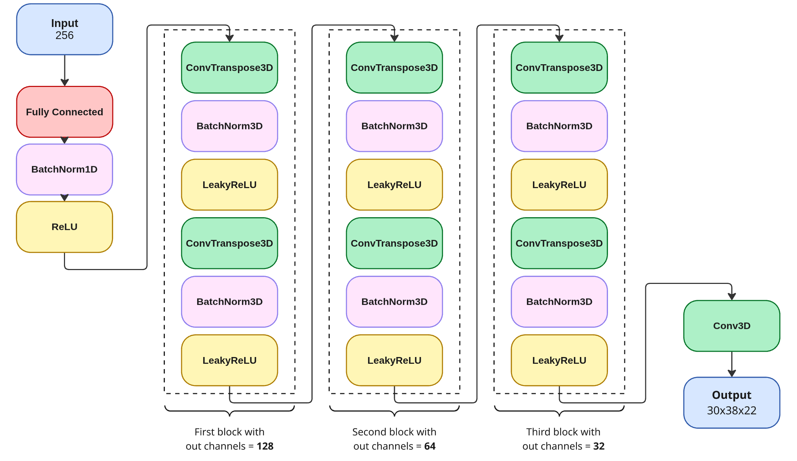
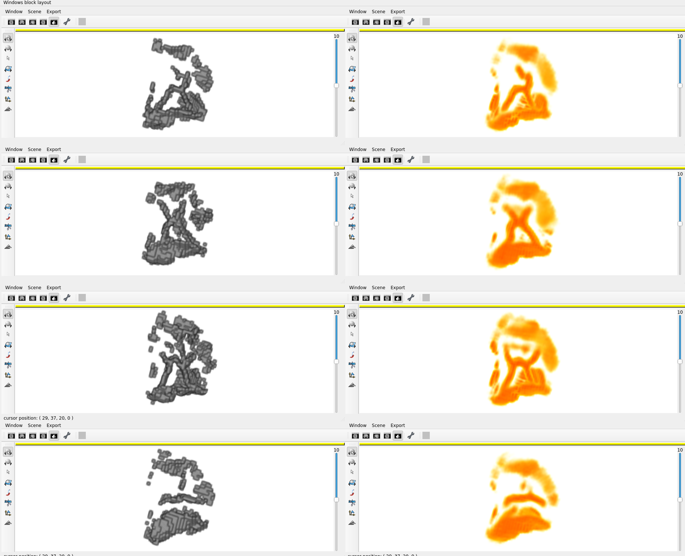

## Champollion-Decoder

```bash
git clone https://github.com/Dufouranto0/2025_Champollion_Decoder.git
cd 2025_Champollion_Decoder
python -m venv decodervenv
. decodervenv/bin/activate
pip install -r requirements.txt
```

## Training a decoder for a specific model

To train a decoder for a specific model, modify the `model_to_decode_path` field in the config file to point to the **directory of the model** you want to decode.  

Also make sure that by concatenating `model_to_decode_path` and `train_csv`, you get the path to the **embeddings corresponding to the subjects used during the training of the encoder**.  

The `val_test_csv` corresponds to embeddings containing subjects used for **validation** in the encoder training.

Then run:

```bash
cd deep_learning
python3 train.py
```

---

## Saving NIfTI files from decoder outputs

If you want to save NIfTI files from the NumPy outputs of the decoder (for now only the subjects within the first two batches have a NumpPy ouput, for visualization), use `save_nii.py` inside a BrainVisa environment (or any environment that contains `aims`).
`save_nii.py` takes the parent folder of the generated .npy files as argument:

```bash
bv bash
cd 2025_Champollion_Decoder/deep_learning
python3 reconstruction/save_nii.py -p example
```

---

## Comparing encoder input with decoder output

To compare the initial encoder input (in black and white in the example below) with the decoder output (in orange in the example below), you also need a BrainVisa environment.
`visu.py` takes the parent folder of the .nii.gz files generated with `save_nii.py`, the loss function that was used during the training and a potential list of subject ids.
If no loss is provided, then bce is used by default, if no list of subjects is provided, 4 subjects among the .nii.gz files will be randomly picked up.

```bash
bv bash
cd 2025_Champollion_Decoder/deep_learning
python3 reconstruction/visu.py \
  -p example \
  -l bce \
  -s sub-1110622,sub-1150302
```

## Decoder Architecture

The architecture of the decoder (file `convnet.py`) is described in the following figure: 



## Example of visualization

In the following figure, 4 input shapes (in black and white, on the left) were encoded using the Champollion V1 architecture, and decoded using this decoder.
The decoder output after 10 epochs is provided here, not as a binary image, but as a continuous image containing the probability of each voxel to be 1 in the inital image.
The higher the probability, the redder the voxel appears. The lower the probability, the more transparent and yellow the voxel appears.


